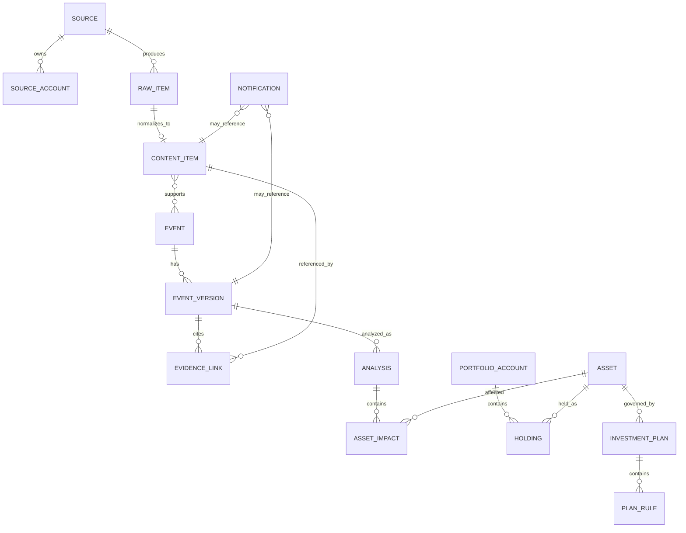

# Data Model

版本：2.1-FROZEN  
状态：Phase 1 entities frozen; later-phase contracts living

## 1. 建模原则

- 表名和字段名使用 `snake_case`；
- 主键使用 UUID；
- 所有时间存 UTC，展示时转换用户时区；
- 外部身份同时保存稳定 ID 和可变显示名；
- 原始内容、标准化内容、事件、分析和通知分层保存；
- 原始记录不可因事件合并被删除；
- 用户确认的计划和规则必须版本化；
- 关键状态变化使用审计记录；
- Phase 1 只创建当前需要的表，未来实体先作为契约，不提前建空表。

## 2. 核心关系



上图同时展示长期关系，但 Phase 1 实际只创建 Source、SourceAccount、CollectionCursor、CollectionRun、RawItem、ContentItem、Notification、OutboxMessage、AuditLog，以及 SPEC-0001 可选的 system_metadata。Event、Evidence、Analysis、Portfolio 和 Investment Plan 只作为未来合同，不提前建表。

## 2.1 Unified News Record 逻辑合同（Proposed）

Unified News Record 是跨 `Source`、`RawItem`、`ContentItem` 及后续 enrichment 的逻辑投影视图，不是要求新增一张“大而全”表。它用于隔离 provider 差异；任何字段落库变化仍需独立 SPEC 和迁移。

| 逻辑字段 | 语义 | 阶段/现有映射 |
|---|---|---|
| `internal_id` | 系统内部稳定标识 | ContentItem/后续 projection |
| `provider` | 数据供应商或承载方，不等同于原始发布者 | Source contract，后续细化 |
| `source_id`, `source_type` | 逻辑来源与类型 | Phase 1 已有 |
| `ingestion_mode` | polling / streaming / webhook / historical_backfill | 后续 connector SPEC |
| `external_id` | provider 稳定外部 ID；未知为 null | Phase 1 已有 |
| `canonical_url` | 确定性规范 URL | Phase 1 ContentItem |
| `title`, `public_summary`, `content` | 标题、合法公开摘要、授权内容 | `source_summary`/body 映射；不得混入 AI 摘要 |
| `language`, `authors` | 来源语言与作者集合 | Phase 1 字段/后续规范化 |
| `published_at` | 媒体发布时间 | `source_published_at` |
| `source_updated_at` | 媒体更新时间 | Phase 1 已有 |
| `first_seen_at` | 系统首次发现时间 | Phase 1 已有 |
| `received_at` | 系统实际收到本条消息的时间 | 后续 ingestion contract |
| `last_checked_at` | 系统最后检查来源/记录的时间 | 后续 ingestion contract |
| `entities`, `topics` | 实体与主题 enrichment | Phase 2，不进 Phase 1 schema |
| `related_companies`, `related_assets` | 公司与资产映射 | Phase 2/3 |
| `access_level`, `license_policy` | 内容访问级别与许可策略 | 后续 access-policy SPEC |
| `raw_payload_reference` | 受控原始载荷引用 | Phase 1 `payload_location` 映射 |
| `cursor`, `sequence_number` | 恢复 cursor 与流序列 | CollectionCursor/后续 streaming contract |
| `content_hash` | 确定性内容指纹 | Phase 1 ContentItem |
| `source_priority` | 来源级确定性优先信息 | Phase 1 policy contract |
| `processing_status` | ingestion/normalization/analysis 状态投影 | 跨阶段 projection |

时间字段必须分别保存，不得用一个“新闻时间”替代：

```text
published_at
source_updated_at
first_seen_at
received_at
last_checked_at
```

内容访问状态候选枚举：

```text
PUBLIC_FULLTEXT
PUBLIC_SUMMARY
SUBSCRIPTION_REQUIRED
LICENSED
LINK_ONLY
BLOCKED
```

`SUBSCRIPTION_REQUIRED`、`LINK_ONLY` 或 `BLOCKED` 仍可形成可追溯线索，但不得伪装成完整正文。Bloomberg、WSJ 等未获得授权全文时，完整正文采集不是成功条件。

## 2.2 恢复与幂等投影（Proposed）

每个实时或轮询来源的运行合同至少表达：

- cursor / sequence number；
- last received time / last acknowledged time；
- retry count / reconnect；
- checkpoint / historical backfill；
- idempotency key / duplicate protection。

现有 Phase 1 schema 已覆盖部分 cursor、retry 和幂等能力；缺失的 streaming/webhook 字段不在本轮补表，必须由后续 SPEC 证明必要性后迁移。

## 3. Phase 1 实体

Phase 1 允许创建：`Source`、`SourceAccount`、`CollectionCursor`、`CollectionRun`、`RawItem`、`ContentItem`、`Notification`、`OutboxMessage`、`AuditLog`。

Phase 1 禁止创建：`Event`、`EventVersion`、`EvidenceLink`、`Analysis`、`AssetImpact`、`PortfolioAccount`、`Holding`、`InvestmentPlan`、`PlanRule`、`CandidateRule`、`PlanReview`。

Phase 1 的 `summary` 只表示来源直接提供的摘要，字段实现时应命名为 `source_summary`，不得保存 AI 摘要。

### 3.1 Source

一个逻辑信息来源。

关键字段：

- `id`
- `code`
- `name`
- `source_type`: `news`, `x`, `official`, `rss`, `api`, `web`
- `access_method`
- `authorization_status`
- `retention_class`
- `enabled`
- `schedule_seconds`
- `last_success_at`
- `consecutive_failures`
- `created_at`, `updated_at`

### 3.2 SourceAccount

来源下的账号、栏目、Feed 或端点。

- `id`
- `source_id`
- `external_id`：稳定平台 ID；未知时为 null，不得编造
- `handle`
- `display_name`
- `endpoint`
- `identity_status`: `unverified`, `verified`, `changed`, `disabled`
- `enabled`
- `collection_options`
- `last_identity_check_at`

`collection_options` 是既有兼容字段，不再作为长期 production target contract。SPEC-0041 Docs
Review 提议新增 `CollectionTarget` 与 typed/versioned config，并把 cursor/run/health 绑定到 target；
当前尚无 migration 或 schema change，既有字段仍是运行事实。Foundation v2.3 Freeze Review 已 PASS，
R1 implementation contract 正在 Docs Review；只有 Review PASS 后的单独明确授权才能形成 migration
implementation authority。最终 schema 见
`spec/SPEC-0041-implementation-unified-production-collection-control-plane.md`。

### 3.2.1 CollectionTarget（Proposed；未实现）

未来每个独立 query、symbol、series 或 CIK operation 对应一个稳定 target。target 拥有自己的
cadence、budget、cursor strategy/version、lock、retry、run、health 与 dispatch identity；不含 secret
或任意 endpoint。Source 继续拥有 provider/授权/retention，SourceAccount 只表达可选外部身份。
字段、迁移和 rollback 见 SPEC-0041；Docs Review 不创建表。

R1 最终合同还区分 `operation_config_version`（typed schema）、`provider_contract_version`（adapter）与
单调 `config_revision`（执行 generation）。RawItem 不重复保存 target_id，而由不可变
RawItem→CollectionRun→CollectionTarget 追溯；PostgreSQL 必须以 null-safe source/account 一致性约束
保护该链。ContentItem/EvidenceItem 已复制 provenance 的完整 DB audit/constraint 决策是 R2/R8 强制
前置项，本 R1 Docs Review 不修改 schema。

### 3.2.2 Durable Safe Projection（Pre-AI candidate；未实现）

现有 bounded pipeline 的安全 projection 不能被描述为已完成的通用 durable contract。R2 将独立审核
versioned/provider-neutral projection persistence、field provenance、retention/redaction 与 restart-safe
replay；不得传播 raw provider payload。是否新增表/字段必须在 R1 后单独设计和迁移审核。

### 3.3 CollectionCursor

- `id`
- `source_account_id`
- `cursor_type`
- `cursor_value`
- `last_published_at`
- `updated_at`

### 3.4 CollectionRun

- `id`
- `source_id`
- `source_account_id`
- `started_at`, `finished_at`
- `status`: `running`, `succeeded`, `partial`, `failed`
- `fetched_count`, `new_count`, `duplicate_count`, `error_count`
- `error_code`, `error_message_redacted`
- `retry_count`

### 3.5 RawItem

原始获取记录。

- `id`
- `source_id`
- `source_account_id`
- `external_id`
- `fetched_at`
- `http_status`
- `content_type`
- `payload_location` 或受限原始载荷
- `payload_hash`
- `retention_class`
- `parse_status`
- `created_at`

### 3.6 ContentItem

统一内容对象，取代模糊的 `News`、`Article`、`Post` 总称。

- `id`
- `raw_item_id`
- `source_id`
- `source_account_id`
- `content_kind`: `article`, `x_post`, `official_release`, `feed_entry`
- `external_id`
- `title`
- `summary`
- `body`
- `body_availability`: `full`, `partial`, `summary_only`, `unavailable`
- `author`
- `language`
- `original_url`
- `canonical_url`
- `source_published_at`
- `source_updated_at`
- `first_seen_at`
- `content_hash`
- `reply_to_external_id`
- `quote_external_id`
- `repost_external_id`
- `deleted_status`: `unknown`, `present`, `deleted`
- `metadata`
- `created_at`, `updated_at`

唯一性优先使用：

1. `source_id + external_id`；
2. `canonical_url`；
3. 来源范围内 `content_hash`。

### 3.7 Notification

- `id`
- `content_item_id` nullable
- `priority`: `P0`–`P4`
- `priority_reason`
- `policy_rule_id`
- `policy_version`
- `channel`: `telegram_push`
- `dedup_key`
- `payload_version`
- `status`: `pending`, `sending`, `sent`, `failed`, `suppressed`
- `scheduled_at`, `sent_at`
- `failure_code`, `retry_count`
- `created_at`

### 3.8 OutboxMessage

用于可靠发布：

- `id`
- `aggregate_type`
- `aggregate_id`
- `message_type`
- `payload`
- `status`
- `attempts`
- `available_at`
- `created_at`, `published_at`

### 3.9 AuditLog

- `id`
- `actor_type`, `actor_id`
- `action`
- `target_type`, `target_id`
- `before`, `after`
- `created_at`

审计数据必须脱敏。

## 4. Phase 2 实体

### 4.1 Event

现实世界中可持续更新的市场相关事件。

- `id`
- `canonical_title`
- `event_type`
- `status`
- `occurred_at`
- `first_seen_at`
- `current_version_id`
- `created_at`, `updated_at`

### 4.2 EventMembership

连接 `ContentItem` 与 `Event`：

- `event_id`
- `content_item_id`
- `relation`: `primary`, `confirmation`, `update`, `analysis`, `correction`, `denial`
- `match_score`
- `match_method`
- `review_status`

### 4.3 EventVersion

- `id`
- `event_id`
- `version_number`
- `fact_summary`
- `fact_status`
- `confidence`
- `change_type`
- `supersedes_id`
- `created_at`

### 4.4 EvidenceLink

- `id`
- `event_version_id`
- `content_item_id`
- `claim_key`
- `evidence_role`
- `source_reliability`
- `excerpt_hash`

### 4.5 Analysis

- `id`
- `event_version_id`
- `analysis_type`
- `model`
- `prompt_version`
- `input_hash`
- `output`
- `confidence`
- `created_at`

### 4.6 Asset 与 Entity

`Asset` 表示可持有资产；`Entity` 表示公司、人物、国家、产品、政策或行业。

Asset 关键字段：

- `id`
- `asset_type`: `us_equity`, `etf`, `crypto`, `cash`
- `symbol`
- `name`
- `exchange_or_network`
- `quote_currency`
- `active`

Entity 与 Asset 通过稳定映射关联，避免仅靠文本代码识别。

### 4.7 AssetImpact

- `analysis_id`
- `asset_id`
- `impact_path`: `direct`, `indirect`, `supply_chain`, `macro`, `cross_market`
- `direction`: `strong_positive`, `positive`, `neutral`, `negative`, `strong_negative`, `uncertain`
- `horizon`
- `severity`
- `reasoning`
- `counter_evidence`
- `confidence`

## 5. Phase 3–4 实体

### 5.1 PortfolioAccount

- `id`
- `name`
- `account_type`
- `base_currency`
- `active`

### 5.2 Holding

- `id`
- `portfolio_account_id`
- `asset_id`
- `quantity`
- `average_cost`
- `cost_currency`
- `market_value`
- `portfolio_weight`
- `opened_at`
- `updated_at`

### 5.3 OperationRecord

用户确认的真实操作：

- `id`
- `holding_id` 或 `asset_id`
- `operation_type`
- `quantity`
- `price`
- `occurred_at`
- `reason`
- `related_event_id`
- `confirmed_by_user_at`

### 5.4 InvestmentPlan

- `id`
- `asset_id`
- `version`
- `status`: `draft`, `active`, `superseded`, `revoked`
- `thesis`
- `holding_horizon`
- `target_exposure`
- `watch_factors`
- `risk_factors`
- `invalidation_conditions`
- `user_planned_actions`：仅记录用户自己的计划，不授权 AI 选择动作
- `review_at`
- `confirmed_by_user_at`
- `supersedes_id`

### 5.5 PlanRule

- `id`
- `investment_plan_id`
- `rule_type`: `watch`, `risk`, `review`, `invalidation`
- `condition`
- `status`
- `source`: `user`, `ai_candidate`
- `confirmed_by_user_at`

只有已确认规则参与长期提醒。

### 5.6 CandidateRule

- `id`
- `asset_id` 或 `investment_plan_id`
- `proposal`
- `evidence`
- `status`: `pending`, `accepted`, `rejected`, `expired`
- `created_at`
- `decided_at`

接受后创建新 PlanRule 或 InvestmentPlan 版本；不得原地静默修改。

### 5.7 UserFeedback

只保存明确反馈：

- `id`
- `target_type`, `target_id`
- `feedback_type`
- `comment`
- `created_at`
- `applied_status`
- `applied_change_id`

禁止保存或使用隐式点击画像作为长期学习依据。

### 5.8 PlanReview

- `id`
- `investment_plan_id`
- `event_version_id`
- `assessment`: `supports`, `weakens`, `review_required`, `possible_invalidation`, `uncertain`
- `evidence`
- `questions_for_user`
- `created_at`

不得包含替用户决定的交易动作。

## 6. 数据完整性

- 金额和数量使用 Decimal；
- symbol 不是全局唯一，唯一键需包含资产类型和交易所/网络；
- 时间为空时保留 null 和来源原文，不猜测；
- Event 合并必须可撤销；
- AI 输出不得覆盖来源事实；
- 删除使用状态与审计，避免物理删除破坏追溯；
- 所有敏感字段进入备份前加密或由加密存储保护。
