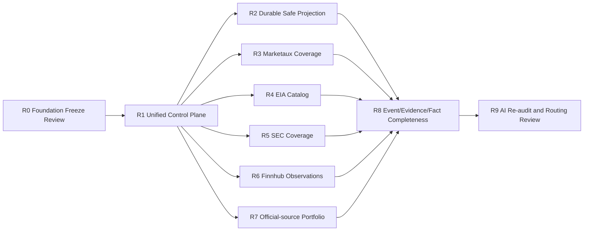

# Pre-AI Collection Readiness Program

Status：AUTHORIZED PROGRAM — each step still requires independent SPEC/Review

Current gate：R0/R1/R2 Completed；R8-A Active — Implementation Review；production authority remains `legacy`；
Migration B/activation/cutover unauthorized

## 1. Purpose and release gate

Real AI routing must not be built on bounded smoke defaults, an unversioned single-target scheduler or ephemeral
projection data. This program completes the provider-neutral collection and factual-input foundation first.
Existing Provider runtime evidence is reused; no live request is authorized by this document.

PR #39/SPEC-0040 stays Draft until **all** steps R0–R8 are accepted. R9 is a new audit/rebase/design review,
not automatic permission to merge or execute AI.

## 2. Dependency map

R3–R7 may be designed in parallel after R1, but each provider operation is separately authorized and production
activation remains serial/reviewed. No readiness step may infer license, quota or retention from a smoke PASS.

## 3. Reviewable steps

### R0 — Foundation Revision / Freeze Review

- **Current limitation:** v2.2 prohibited scheduler rewrite and limited implementation to SPEC-0039.
- **Target:** explicit authority for pre-AI reliability, target schema/control plane and delivery decoupling.
- **Safety/license:** all existing single-user, Broad Scan, secret, licensed-content and no-trading boundaries stay.
- **Non-goals:** code, migration, provider request, AI request or automatic PR #39 approval.
- **Dependencies:** historical v2.2-FROZEN and SPEC-0039 PASS.
- **Impact:** documents only; no runtime/config/schema change.
- **Verification gate:** Foundation diff, decision impact and downstream-document review.
- **Acceptance:** PASS（2026-08-13；baseline `4df76e1f0ed9812d962369b9766bf372b102d952`）。
  R0 is completed; R1 Docs Review subsequently passed and the user separately authorized bounded I-A/II/III/IV
  implementation. That later authorization does not change the scope of the R0 decision itself.

### R1 — Unified Production Collection Control Plane

- **Current limitation:** the reviewed multi-target control plane, typed targets and decoupled delivery are merged
  but inactive; production authority remains `legacy`.
  Existing bounded Provider operations and smoke evidence do not prove complete production coverage.
- **Target:** SPEC-0041 `CollectionTarget`, target-owned state, typed config, unified factory, independent delivery,
  operation budgets and cursor/backfill/revision contracts.
- **Safety/license:** worker-only credentials, operation/transport allowlists, legacy defaults paused, fail closed.
- **Non-goals:** new provider operation, safe-projection payload redesign, Event/AI behavior.
- **Dependencies:** R0 PASS; PR #39 remains frozen; current main migration inventory audited.
- **Impact:** new target/state migration; ORM/config/task/scheduler/factory changes; staged legacy cutover.
- **Verification gate:** mock/unit plus PostgreSQL/Redis/Celery integration; upgrade/downgrade/upgrade; no live call
  until an independently approved bounded cutover verification.
- **Acceptance:** multiple targets independently schedule/retry/checkpoint/recover; no double collection; delivery
  failure cannot stop collection; rollback drill PASS.

Canonical `RawItem.collection_run_id` records only the first canonical persistence run. R2 adds a separate durable
run↔item observation association; overwriting that immutable first-run lineage or inserting duplicate canonical
RawItems remains prohibited.

### R2 — Durable Safe Projection（Completed — Implementation Review approved）

- **Current limitation:** R1 persisted only canonical RawItem; legacy display/evidence sidecars are not the R2 factual
  authority. R2 implementation now introduces durable observation lineage and typed factual projection for the four
  existing operations, pending independent review and without production activation.
- **Target:** durable, versioned, provider-neutral safe projection derived from RawItem/Evidence, with content/
  numeric/official-fact allowlists, provenance and retention class.
- **Safety/license:** no raw response, secret, unrestricted body or unauthorized full text; field-level provenance
  and redaction/version audit required.
- **Non-goals:** Event clustering, AI summarization, semantic normalization or provider SDK fields downstream.
- **Dependencies:** R1 target identity/provenance; approved provider contracts.
- **Impact:** additive Migration `0007`, ORM models, atomic collection handoff, exact v1 typed contracts, independent
  bounded validation worker and authority-neutral periodic reconciliation; no existing table is removed or
  rewritten. Legacy placeholder mapping remains compatibility-only, not Rich Evidence input.
- **Verification gate:** synthetic/mock fixtures, PostgreSQL persistence/idempotency/replay, redaction/source audit;
  any live verification separately authorized and structural only.
- **Acceptance:** restart-safe projection can reproduce allowed Evidence/Content inputs, reject unsafe content and
  trace every field to target/run/raw/evidence without provider SDK dependency.

### R8-A — SafeFactProjection → Evidence Durable Handoff（Active — Implementation Review）

- **Current limitation:** READY factual projections are durable, but canonical Evidence has no durable per-revision
  handoff state or link to the factual source.
- **Target:** additive `evidence_projection_links`, canonical Evidence adoption/creation, allowlisted Marketaux/SEC
  Content, bounded retry/stale recovery, and authority-neutral reconciliation.
- **Safety:** factual payload is not copied to Evidence; Finnhub/EIA values remain available through the projection
  link; no placeholder mapper, Notification, Event, Fact, ImpactAnalysis, AI, or external request.
- **Acceptance:** four Provider projections link idempotently; revisions preserve projection hashes while sharing
  canonical Evidence; provenance conflicts fail closed; production authority remains legacy.

### R3 — Marketaux Query, Topic, Entity, Pagination and Time-window Readiness

- **Current limitation:** implemented bounded `news/all` operation and historical `technology`, limit=1 evidence do
  not prove broad-scan query portfolio, entities/topics, pagination or window recovery.
- **Target:** typed/versioned operations for reviewed broad-scan query sets, watch topics/entities, page/
  continuation and bounded time windows with target-specific budgets.
- **Safety/license:** plan/quota/retention/internal-AI/redistribution remain Pending until user contract evidence;
  metadata/public-summary only unless explicitly authorized; never fetch article pages.
- **Non-goals:** new Marketaux endpoint without review, full text, semantic dedup, recommendation or AI.
- **Dependencies:** R1 and applicable R2 projection schema; contract/plan review per operation.
- **Impact:** typed configs/validators, adapter pagination/time-window support and target catalog; schema only if R1/R2
  requires it.
- **Verification gate:** mocked pagination/continuation/rate-limit tests, licensed fixture review, then one separately
  approved bounded live contract verification per new operation.
- **Acceptance:** no gaps/duplicates across page/window restart, request budget enforced, broad-scan targets explicitly
  approved, and no smoke query becomes an implicit production default.

### R4 — EIA Dataset/Route/Frequency/Facet Catalog

- **Current limitation:** current operation is bounded electricity retail-sales monthly price and does not represent
  EIA datasets, routes, frequencies or facet combinations generally.
- **Target:** reviewed typed catalog for selected electricity RTO/grid, generation, petroleum/inventory or other
  in-scope official series; route, frequency, data columns, facets, units and revisions explicit per target.
- **Safety/license:** official API terms/attribution, key secrecy, row/period budgets, nullable numeric semantics and
  revision provenance; no claim that all EIA routes are authorized/implemented.
- **Non-goals:** energy analysis, universal EIA crawler, historical warehouse or commodity recommendation.
- **Dependencies:** R1; R2 typed numeric projection; user-approved series inventory.
- **Impact:** EIA operation config/catalog, cursor/revision codecs and bounded backfill policy; no arbitrary route URL.
- **Verification gate:** official-schema fixtures, facet/frequency/unit/revision tests, pagination/restart integration,
  then separately authorized minimal live verification per route family.
- **Acceptance:** every active series has explicit identity/unit/frequency/facets/cursor/revision policy and survives
  unchanged/newer/older/revised observations without data loss or duplicate facts.

### R5 — SEC Multi-company, Historical Submissions and Company Facts/XBRL

- **Current limitation:** bounded AAPL/CIK submissions-recent metadata does not cover multiple companies,
  submissions history files, companyfacts/XBRL taxonomy or revisions.
- **Target:** typed target catalog for multiple approved CIKs, recent/historical submission metadata and separately
  reviewed companyfacts/XBRL facts with accession/form/period/unit/taxonomy provenance.
- **Safety/license:** SEC Fair Access/User-Agent runtime boundary; no filing body or primary-document download;
  request budgets and official revision/amendment semantics.
- **Non-goals:** full filing parser, universal XBRL interpretation, legal/investment analysis or bulk archive mirror.
- **Dependencies:** R1; R2 official fact projection; company/CIK allowlist and taxonomy contract review.
- **Impact:** typed operations, historical continuation, fact/revision mapping; additive Fact schema only after its
  own review.
- **Verification gate:** mocked columnar/history/XBRL/revision cases, multi-CIK integration and Fair Access controls;
  bounded live checks separately authorized.
- **Acceptance:** target isolation per CIK/operation, historical continuation without filing-body download, facts
  preserve accession/taxonomy/unit/period and amendments do not silently overwrite history.

### R6 — Finnhub Multi-symbol Typed Market Observations

- **Current limitation:** bounded AAPL quote and small smoke limits do not establish multi-symbol schedules, typed
  observation history or market-validation semantics.
- **Target:** one target per approved symbol/operation, typed quote/company observation contract, timestamp/snapshot
  policy and target/rate-group budgets.
- **Safety/license:** process-only token, plan/quota/retention review, numeric values confined to authorized typed
  projection; no provider payload downstream.
- **Non-goals:** historical price warehouse, trading signal, price target, investment recommendation or Market
  Validation runtime. Future Market Validation requires a separate Foundation/SPEC review.
- **Dependencies:** R1; R2 numeric projection; explicit symbol scope and plan review.
- **Impact:** typed operation config, multi-symbol target catalog and numeric observation mapping.
- **Verification gate:** mock multi-symbol isolation/snapshot/idempotency/rate-limit tests, PostgreSQL integration,
  then separately authorized bounded live verification.
- **Acceptance:** symbols have independent cadence/cursor/health, typed timestamped observations and no cross-symbol
  state leakage; no analysis semantics are inferred.

### R7 — Company IR, Official RSS, Macro and Regulatory Sources

- **Current limitation:** these are catalog/planned evidence layers, not implemented production sources.
- **Target:** prepare independent SPECs for prioritized, provider-neutral official-source operations covering
  Company IR, official RSS and government/macro/regulatory feeds that fit existing Collection Scope and explain
  U.S. equities, U.S. ETFs, Crypto and related cash positions. R0/R7 itself creates, activates and requests nothing.
- **Safety/license:** source-by-source terms/robots/retention/attribution, official identity verification, metadata/
  link-only default and no arbitrary web fallback.
- **Non-goals:** new commercial provider selection, X, unrestricted crawling, full-text assumption, streaming or
  webhook infrastructure.
- **Dependencies:** R1/R2; Source Catalog review; one independent provider/operation SPEC per endpoint family.
  Every family must independently complete official identity verification; access/license/robots/retention/
  attribution review; typed operation/adapter contract; request budget/cursor/revision/recovery contract; mock/
  integration verification; user-authorized bounded live verification; and production activation review.
- **Impact:** new Source/Account/Target records and adapter/config only after authorization; migration only for
  genuinely new generic contracts.
- **Verification gate:** official documentation, mock/fixture contracts and package safety first; each endpoint gets
  explicit bounded live authorization and license review.
- **Acceptance:** independent Docs/Implementation/production-activation reviews explicitly PASS every gate before
  a target becomes active. A reviewable independent SPEC is not automatic approval to implement or activate.
  Commercial news Providers, X, streaming/webhook/event-bus, arbitrary web crawlers/endpoints remain prohibited;
  sources beyond current Collection Scope, market scope or safety boundaries require a new Foundation Revision.

### R8 — Event / Evidence / Fact Completeness

- **Current limitation:** SPEC-0039 EventCandidate foundation exists, while durable safe projections and expanded
  official/structured facts are not yet complete; PR #39 Fact/AI design predates the final readiness contracts.
- **Target:** provider-neutral completeness rules for EventCandidate inputs, Evidence authority, durable projections,
  official facts, contradictions, revisions, truncation and missing-data visibility.
- **Safety/license:** Event/Fact never reads raw provider payload or secret; missing evidence remains visible;
  content/numeric retention follows source policy.
- **Non-goals:** real model call, semantic clustering, market validation, recommendation or automatic Event merge.
- **Dependencies:** R2 plus accepted in-scope outputs from R3–R7; SPEC-0039 invariants preserved.
- **Impact:** Event/Evidence/Fact contract and possibly additive schema migration only after independent design review.
- **Verification gate:** deterministic fixture corpus, provenance/revision/contradiction/truncation/idempotency tests,
  Phase 1 regressions and no-network integration.
- **Acceptance:** representative news, market, energy, filing and official evidence produce complete, bounded,
  reproducible facts with explicit unknowns and reversible provenance.

### R9 — AI Deterministic + Model Routing Re-audit

- **Current limitation:** PR #39 is based on pre-readiness schema/contracts and cannot be assumed compatible.
- **Target:** audit deterministic preprocessing, Fact input, analyzer contract, model routing, persistence,
  evaluation and safety against final R1–R8 contracts.
- **Safety/license:** no real AI until new review authorizes it; process-only credential, one bounded request only
  under separate authorization; no trading language or raw provider content.
- **Non-goals:** automatic PR #39 merge, preserving every existing design, recommendation, portfolio or Market
  Validation runtime.
- **Dependencies:** all R0–R8 acceptance PASS; latest `main`; migration chain linear.
- **Impact:** PR #39 must be re-audited/rebased or replaced; migrations renumbered/rebased by serial history without
  double heads or rewriting published revisions.
- **Verification gate:** docs/contract review first, mocked model transports, deterministic benchmark and full
  regression; any real model request separately authorized.
- **Acceptance:** Reviewer explicitly approves the final AI boundary and exact implementation diff after rebase.

## 4. Program completion rule

The program is not complete because a smoke, adapter or individual provider passes. Completion requires R0–R8
acceptance evidence, linear migrations, current-main regressions, documented license/retention gaps, and no
unresolved production-control-plane blocker. Only then may R9 begin. This document does not start R1–R9.
