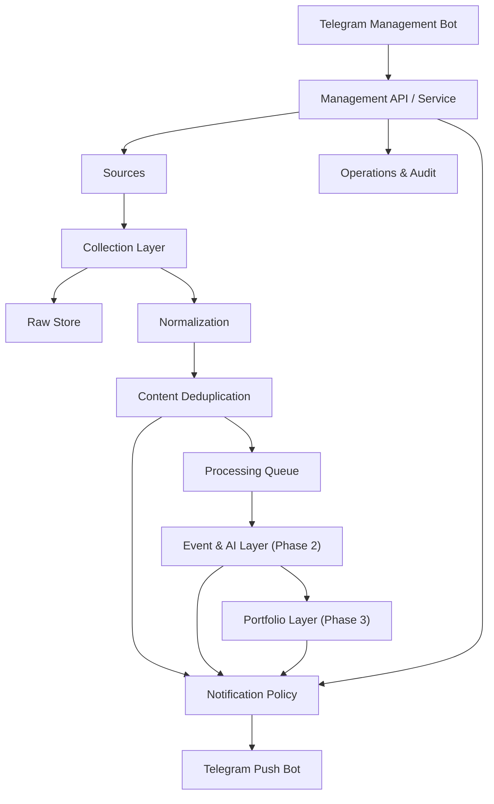

# System Design

版本：2.1-FROZEN  
状态：Phase 1 architecture frozen

## 1. 总体架构



Phase 1 只实现采集、原始存储、标准化、基础去重、通知和运维接口。未实现的未来模块必须有稳定接口边界，但不得以空洞“引擎”增加复杂度。

## 2. 模块职责

### 2.1 Source Registry

保存来源类型、接入方式、授权状态、轮询策略、健康状态和内容保留等级。精确来源信息见 `SOURCE_CATALOG.md`。

### 2.2 Collection Layer

适配器只负责：

- 合法访问来源；
- 获取原始响应；
- 解析来源标识和时间；
- 生成标准采集结果；
- 返回可分类错误。

适配器不得：

- 直接发送 Telegram；
- 写入投资规则；
- 自行执行 AI 判断；
- 绕过访问控制；
- 在失败时静默丢弃。

### 2.3 Raw Store

在许可范围内保存原始响应、内容哈希、获取时间、HTTP 元数据和解析状态。受版权限制时，可只保存必要元数据、短摘要和哈希，不保存完整正文。

### 2.4 Normalization

将不同来源统一为 `ContentItem`：

- 来源与外部 ID；
- 内容类型；
- 标题、摘要、正文可用性；
- 作者；
- 原始 URL 和规范化 URL；
- 发布时间、更新时间和首次发现时间；
- 媒体链接；
- 回复、引用、转发关系；
- 原始语言；
- 完整性和证据状态。

### 2.5 Content Deduplication

Phase 1 只做确定性或高置信基础去重：

- `source_id + external_id`；
- 规范化 URL；
- 内容哈希；
- 明确的转发/引用关系。

不得在 Phase 1 用模糊语义合并不同事件。Phase 2 才进行 Event 聚合，且原始 Content Item 永不因合并而删除。

### 2.6 Event & AI Layer

Phase 2 实现：

- Event 候选召回；
- 时间、实体、动作和语义联合判断；
- Evidence 与事实状态；
- Event 状态机和版本；
- 翻译、摘要、分类、影响和不确定性。

外部内容始终作为数据放入隔离上下文，不得触发工具、管理 API 或数据库写操作。

### 2.7 Portfolio Layer

Phase 3 读取：

- 当前持仓；
- 资产映射；
- 用户确认的 Investment Plan；
- Event Analysis；
- 必要行情快照。

输出影响映射、集中度和复核提醒，不输出替用户作出的交易动作。

### 2.8 Notification Layer

负责优先级、静默、合并、幂等、更新和投递状态。通知不决定 Collection Scope。

### 2.9 Management Plane

第一阶段通过管理 Bot、CLI 或受保护 API 提供：

- 来源与账号启停、配置和健康查询；
- 调度、Cursor 和 CollectionRun 查询；
- 失败任务和人工重试；
- Notification 与 Outbox 状态；
- 确定性通知规则和静默时间；
- 备份、恢复和 Token 轮换；
- 审计查询。

Phase 1 不提供 Event、AI Prompt、Portfolio、Holding、Investment Plan 或 Candidate Rule 管理。不要求 Web Dashboard。

## 3. Phase 1 通知优先级 P0–P4

Phase 1 的 Priority 表示投递紧急程度，不是 AI 市场影响评分，也不是持仓风险评分。

| 级别 | Phase 1 定义 | 默认行为 |
|---|---|---|
| P0 | 用户显式最高紧急规则，或来源官方告警标记被配置认可 | 立即推送，不受普通静默影响 |
| P1 | 高优先 Source/SourceAccount、内容类型或 breaking 规则命中 | 立即推送 |
| P2 | 明确重要主题、公司、监管、宏观、产业链或资产关键词规则命中 | 实时或最多 5 分钟聚合 |
| P3 | 普通项目范围内容 | 普通推送、批次或小时级摘要 |
| P4 | 背景、弱优先级或仅存档规则命中 | 保存，默认不即时推送 |

Phase 1 只允许来源等级、账号、内容类型、明确关键词、来源官方标记、时间和用户显式配置参与优先级。每条 Notification 保存 `priority_reason`、`policy_rule_id` 和 `policy_version`。

Phase 2 才能加入 Event、Evidence 和 AI 影响因素；Phase 3 才能加入持仓关联。

## 4. 事件生命周期

```text
candidate
→ developing
→ confirmed
→ corrected / denied
→ resolved
→ archived
```

状态并非简单线性。每次状态变化形成 `EventVersion`，记录：

- 新增和撤回事实；
- 新 Evidence；
- 可信度变化；
- 影响判断变化；
- 通知结果。

## 5. 时间与延迟

必须区分：

- `source_published_at`：来源发布时间；
- `source_updated_at`：来源更新时间；
- `fetched_at`：本次获取时间；
- `first_seen_at`：系统首次发现时间；
- `processed_at`：标准化或分析完成时间；
- `pushed_at`：通知成功时间。

来源目标延迟是服务目标，不是外部平台承诺。建议目标：

- X 流式或官方接口：15–60 秒；
- 正式新闻 API：30 秒–3 分钟；
- RSS/公开 API：1–5 分钟；
- 普通网页：3–15 分钟；
- 正文补充与事件更新：5–30 分钟。

## 6. 可靠性

- 使用稳定幂等键；
- 队列至少一次投递，消费者幂等；
- 指数退避与抖动；
- 来源级熔断，单源故障不影响其他来源；
- 保存游标或水位，支持补采；
- 推送 Outbox，数据库提交与通知解耦；
- Dead Letter Queue 或等价失败记录；
- 重启不丢失未完成任务；
- 所有任务有超时和可分类错误码。

## 7. 安全与隐私

- Bot Token、API Key、Cookie 和数据库密码只从秘密存储或本地环境读取；
- 管理 Bot 使用 Telegram User ID 白名单；
- 推送 Bot 无管理权限；
- 持仓、计划、操作和反馈属于敏感数据；
- 数据导出、删除和规则变更需要审计；
- 外部 HTML、链接和附件隔离处理；
- 日志脱敏，禁止输出完整 Token、Cookie 或正文中的敏感字段；
- Review ZIP 必须执行秘密扫描。

## 8. 数据保留与备份框架

具体天数由部署 SPEC 配置，但必须区分：

| 数据 | 默认原则 |
|---|---|
| 来源元数据、URL、时间和哈希 | 长期保留，用于追溯与去重 |
| 合法公开正文 | 按配置保留并记录许可等级 |
| 付费或受限正文 | 不默认长期保存；按授权保留最小必要信息 |
| 删除的 X 内容 | 保留删除检测事实和哈希；正文是否保留取决于政策与许可 |
| AI 输入输出 | 保留版本、证据引用和必要审计数据 |
| 持仓、计划、操作、反馈 | 加密备份，可导出、可删除、保留版本 |
| 运行日志 | 按滚动策略保留并脱敏 |

每个可发布版本至少提供：

- 数据库备份命令；
- 恢复命令；
- 一次恢复演练证据；
- Token 轮换步骤；
- 迁移回滚说明；
- Review ZIP 排除备份和本地数据的规则。

## 9. 推荐技术基线

SPEC-0001 固定第一版基线：

- Python 3.12；
- FastAPI；
- SQLAlchemy 2.x；
- Alembic；
- PostgreSQL 16；
- Redis 7；
- Celery 5 + Celery Beat；
- httpx、feedparser；
- Pydantic Settings；
- pytest、pytest-asyncio；
- Ruff、mypy；
- Docker Compose。

Playwright 和正文提取库只在真实来源需要时引入，避免基础工程过度依赖。

## 10. 可观测性

至少记录：

- 每来源最后成功时间；
- 拉取次数、成功率、错误类型和连续失败数；
- 新内容数、重复数和解析失败数；
- 首次发现延迟和推送延迟；
- 队列深度、重试和死信；
- Telegram 成功率；
- AI 阶段的耗时、成本和失败率；
- Event 合并误判、重大漏报和重复通知等质量指标。
