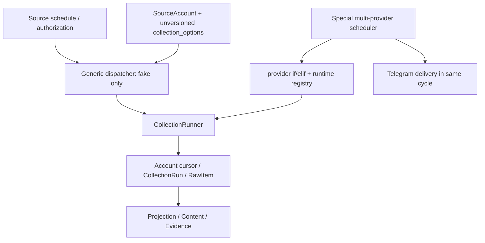
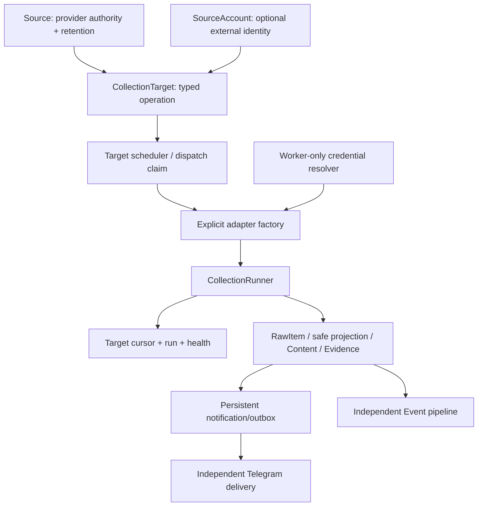

# SPEC-0041 — Unified Production Collection Control Plane

状态：Active — Docs Review（implementation not authorized）

阶段：Cross-phase collection reliability

负责人：Codex（设计执行）；用户/Reviewer（架构与实现授权）

创建日期：2026-08-13

最后更新：2026-08-13

## 1. 目标

设计一个 target-driven、provider-neutral、可迁移的统一生产采集控制面，使当前四个已批准
Provider 与未来官方来源共享同一调度、执行、cursor、retry、health 和恢复生命周期。本 SPEC
只交付 Docs Review；不修改 Python、migration、ORM 或运行数据，Review PASS 也不自动授权实现。

## 2. 基线与现状审计

设计基线为 `main@047c56410733cdcbf3b82e3b909a5cd6b05170dd`。PR #39
`1688e1ffb26d6c91214fee59f7da6d858924c750` 保持 Draft；其 SPEC-0040 与 migrations
`0006/0007` 不属于本分支，也不得被合并、重放或扩展。



已核实限制：

- schema 允许多个 `SourceAccount`，真实 runtime 却要求每个 provider 恰好一个 eligible target；
- generic dispatcher 过滤 `access_method="fake"`，task 也只构造 fake registry；
- real providers 由特殊 scheduler 按 provider Redis key 调度，并以 `if/elif` 注入 adapter；
- due 主要以 Source 最近 run/成功时间计算，同 Source 多账号不能独立 cadence；
- `SourceAccount.collection_options` 是任意、无版本 JSON；bootstrap 的 AAPL、technology、
  electricity 等 smoke 默认容易被误读成生产授权；
- cursor 归属 account，run 没有稳定 target identity；一个全局 `limit` 被解释成不同 operation 的
  文章、quote、series 或 filing 数量；
- collection 与 Telegram 在特殊 cycle 中编排，尚非统一 production control plane。

现有四 Provider 的 adapter、bounded runtime、最小 pipeline 与 scheduler evidence 均保留为已实现
事实；本审计只说明它们尚未形成多 target 通用控制面，不撤销既有 PASS。

## 3. Foundation 与治理边界

- Active Foundation：v2.2-FROZEN；本设计不修改 Foundation 或阶段边界。
- Provider-neutral、failure-visible、credential isolation、Broad Scan 与 Controlled Push 决策继续生效。
- SPEC-0041 是唯一 Docs Review；不与 PR #39 的未合并 SPEC-0040 并行实施。
- NewsAPI.ai / Event Registry 保持 future/blocked；GDELT 保持 runtime blocked/future evaluation。
- SPEC-0005 X 范围不变；不得由控制面迁移自动创建或授权新来源。

## 4. 目标架构



核心原则：调度单元、锁单元、cursor 单元、retry 单元和 health 单元都是
`CollectionTarget`；Provider 只是 factory key 和 rate-limit group 的一个维度。

## 5. 职责与 target 数据模型

### 5.1 既有实体职责

| 载体 | 长期职责 | 不再承担 |
|---|---|---|
| `Source` | 逻辑 provider/source、`access_method`、授权、许可/retention 默认、全局 enabled | target cadence、具体 query/symbol/series、target health |
| `SourceAccount` | 可选账号/feed/组织身份与 identity verification；一个账号可有多个 target | 任意 `collection_options` 作为生产合同；cursor/schedule 的唯一载体 |
| `CollectionTarget`（新表） | 一个可独立运行且稳定寻址的 provider operation | secret、任意 endpoint、provider response |
| typed config | provider+operation 的版本化参数；严格 allowlist 与 schema validation | credential、cadence/cursor/health 等通用控制字段 |

### 5.2 Proposed `collection_targets`

| 字段 | 类型/约束 | 语义 |
|---|---|---|
| `id` | UUID PK | 内部稳定 identity |
| `target_key` | string UNIQUE, immutable | 人类可审计稳定键；不由可变 config hash 生成 |
| `source_id` | FK RESTRICT, required | provider/授权/retention authority |
| `source_account_id` | FK RESTRICT, nullable | 仅在 operation 需要账号身份时绑定；必须同 source |
| `provider_key` | string, required | 必须等于经审核的 `Source.access_method` |
| `target_type` | string, required | 如 `news_query`, `quote_symbol`, `eia_series`, `sec_submissions` |
| `operation_key` | string, required | factory allowlist operation；不得是 URL |
| `config_schema_version` | positive int | typed config decoder version |
| `provider_contract_version` | string | adapter contract/field mapping version |
| `config` | JSONB | 仅 schema allowlist 的非秘密 operation 参数 |
| `enabled`, `status` | bool + enum | `draft/active/paused/blocked/retired`；只有 active+enabled 可调度 |
| `cadence_seconds` | positive int | target-specific normal cadence |
| `batch_size` | positive int | operation-specific unit，受 plan 和 hard ceiling 限制 |
| `timeout_seconds` | positive int | 单 request 上限，不超过 run deadline |
| `max_pages_per_run` | positive int | 本 run 有界分页；不能伪装 complete |
| `max_runtime_seconds` | positive int | target run deadline |
| `cursor_strategy` | enum | strict/snapshot/page/date_window/compound/revision |
| `cursor_version` | positive int | cursor codec/version |
| `collection_mode` | enum | incremental/snapshot；backfill 由独立 run mode 表达 |
| `backfill_policy` | enum/ref | disabled/manual/bounded；不是 normal cursor |
| `revision_policy` | enum | ignore/replace-safe/reconcile；provider contract 明确 |
| `retention_policy_ref` | string/FK candidate | 不可放宽 Source 的授权/许可上限 |
| `priority` | bounded int | dispatcher fairness，不是内容重要性 |
| `rate_limit_group` | nullable string | 共享 provider/account quota bucket |
| timestamps | timezone-aware | 审计与生命周期 |

建议约束：`UNIQUE(source_id, target_key)` 或全局 `UNIQUE(target_key)` 二选一，implementation
Docs Review 固定后不可改变；推荐全局唯一、不可变 `target_key`，格式为内部 slug 而非原始 query。
`config` 通过 `(provider_key, operation_key, config_schema_version)` 查找显式 validator；未知版本
fail closed。数据库禁止常见 secret marker，service 还必须递归检查 key/value 与 URL。

### 5.3 target-specific state

后续 migration 应把 target identity 加入或迁移到：

- `collection_cursors.target_id`：`UNIQUE(target_id, cursor_type, cursor_version, run_mode)`；
- `collection_runs.target_id`：每次 run 可追溯目标；
- `raw_items.target_id`（推荐）：直接 provenance；若第一实现暂不加，必须由 immutable run 关系可逆追溯；
- `collection_target_health`（推荐新表）或 target 上受控 health 字段：last attempt/success、连续失败、
  last safe error、next eligible time。不得继续用 Source 汇总状态驱动单 target 调度。

Target 删除默认禁止；retire 代替删除。Source/Account 关闭会使所有子 target fail closed。

## 6. Typed config 和 request budget

首批 operation schema 只覆盖当前已实现范围：

| Provider | target type / operation | typed config 示例（非授权默认） | batch unit |
|---|---|---|---|
| Marketaux | `news_query/news_all` | query、language/filter allowlist | result items |
| Finnhub | `quote_symbol/quote` | symbol | one quote snapshot |
| EIA | `eia_series/electricity_series` | route、facets、sort | data rows |
| SEC EDGAR | `sec_submissions/submissions_recent` | CIK/ticker reference | recent filing metadata |

Effective request budget is the minimum of: operation hard safety ceiling、verified plan/quota bound、
target override、worker global emergency ceiling。每 run 还限制 max requests/pages、wall-clock deadline 和
response bytes。quota exhaustion 进入 rate-limit group cooldown；不得用一个全局 `limit` 给不同 operation
相同语义。达到 max pages/runtime 后保存 continuation 并返回 partial/continuation，不得标 complete。

## 7. Registry / factory 与 credential boundary

统一 `ProviderAdapterFactory` 以 `(provider_key, operation_key, provider_contract_version)` 为显式
allowlist key。注册表由启动代码静态组装，不允许 dynamic import、数据库 class path 或任意 endpoint。

```text
validated target descriptor
→ factory lookup (unknown => fail closed)
→ worker CredentialResolver resolves named secret reference
→ operation-specific credential object (memory only)
→ allowlisted transport + adapter
→ CollectionRunner
```

- DB、typed config、Celery payload、Redis marker、repr、日志和错误不得包含 secret；
- task payload 只携带 `target_id`、dispatch/run identity 和 config version；worker 必须重新从 DB 加载并
  复核 target/source/account authorization，禁止信任序列化 config；
- credential 只在 worker runtime 按 provider/credential reference 解析，不可由 CLI task argument 注入；
- factory 必须验证 adapter.provider 与 target provider、operation、contract version 匹配；
- transport host/method/endpoint family 逐 operation allowlist；禁止 fallback 到网页或其他 provider；
- credential missing 是 target-level blocked/config failure，不泄露名称或值，也不阻止其他 target。

现有 `AdapterRegistry` 与 `ProviderAdapterRegistry` 在实现期合并到上述一个 production factory；fake
作为明确 `fake/test` operation 保留，不能成为真实 provider fallback。

## 8. Scheduler / worker 生命周期

1. Scheduler 分页查询 active target，而非按 Source 限 1000 条。
2. 校验 Source/Account authorization、target config/version 与 `next_eligible_at`。
3. 以 target+scheduled slot 原子 claim dispatch marker；并发 Beat/restart 只能 enqueue 一次。
4. task payload 只发送 `target_id`、slot、dispatch id。
5. Worker 重新加载 target，获取 target owner-token lock，并创建 target-bound `CollectionRun`。
6. Factory 注入 adapter/credential/transport；runner 执行受 budget 限制的 pages。
7. 每 batch 原子持久化 RawItem/sidecar downstream input；成功后才 checkpoint。
8. 完成、continuation、no-new-items 或分类失败分别更新 target health/next eligible time。
9. 安全释放 lock；stale recovery 按 target/run 恢复，不推进 cursor。
10. Content/Evidence 后续生成 notification/outbox；独立 delivery worker 消费，绝不反向决定 collection。

每个 target 独立 cadence、cursor、lock、retry、run、health 和 dispatch idempotency。一个 target
missing/blocked/failed 不跳过同 provider 其他 target，也不污染 Source 的调度资格。

## 9. Cursor、pagination、backfill 与 revision 合同

Cursor envelope 必须版本化并至少记录 strategy、position、tie-breaker、continuation、watermark、
run_mode 和 contract version；codec 由 operation 显式注册。

| strategy | 合法推进 | no-new-items / failure |
|---|---|---|
| strict incremental | candidate 严格大于 current | 相等是否 duplicate/no-new 由 operation 明确；更小 fail visible |
| snapshot watermark | newer 才推进 | 相等是正常 no-new；older fail visible |
| page/offset | 当前 page 完整持久化后保存 next page | page cursor 不等于时间 watermark |
| date window | 窗口完成后推进 boundary | overlap + stable identity 去重；不可跳过未完成窗口 |
| compound | `(timestamp, stable tie-breaker)` lexicographic | 同 timestamp 多 item 逐一覆盖，缺 tie-breaker fail closed |
| revision/reconciliation | official identity + revision marker | stale revision 不覆盖 newer authority |

- normal polling cursor 与 backfill cursor 必须用 `run_mode`/独立记录隔离；backfill 仅 manual/bounded；
- target 是 cursor owner，不能共享 provider/account cursor；
- batch persistence 与 checkpoint 同一事务边界或经证明等价；失败不推进；
- reaching page/runtime cap 保存 continuation，下一 run 从 continuation 恢复；最终完成后再推进 watermark；
- restart 从 committed checkpoint 恢复；在途无 checkpoint batch 可安全重放且由 RawItem idempotency 吸收；
- cursor codec/version 升级必须有显式 migration/compat reader，不得静默 reinterpret JSON。

## 10. Failure、retry、health 与 recovery

| 类别 | 行为 |
|---|---|
| unknown provider/operation/config version | target BLOCKED；不 retry storm；其他 target 继续 |
| credential/authorization/config invalid | target BLOCKED；不消耗 provider 全局 cadence；人工修复后恢复 |
| timeout/429/5xx | target RETRY；尊重 Retry-After 与安全上限；target-specific full jitter |
| quota exhausted | rate-limit group cooldown；其他不共享 quota 的 target 可运行 |
| persistence/checkpoint failure | run failed/retryable；cursor 不推进 |
| cursor backward/invalid continuation | contract failure visible；不覆盖 current |
| stale run/lock loss | owner-token recovery 标 failed；不推进 cursor；重新 dispatch 受幂等保护 |
| Telegram credential/delivery failure | notification 保持 pending/retryable；collection cadence 不变 |

Retry 是 target state，不能复用 provider cadence key。non-retryable failure 按 target normal cadence 或
人工 unblock；retryable failure 使用 `next_retry_at` 早于 normal cadence。Source health 只做聚合展示，
不得让一个 target success 掩盖另一个失败。

## 11. Migration proposal（implementation 才执行）

### 11.1 Dependency/branch rule

- 实现必须从届时最新 `main` 新分支开始，不从本 Docs PR 或 PR #39 分支直接堆叠。
- 若 PR #39 已合并，new revisions 的 `down_revision` 接其实际 head（预计包含 `0006/0007`），并在
  migration tests 验证；若未合并，本控制面 migration 先接当前 main head，PR #39 之后必须 rebase/
  重新编号并解决双 head。禁止猜测 revision、复制 0006/0007 或 rewrite 已发布历史。
- 合并顺序必须串行；任何双 head 在 merge 前解决并跑 upgrade/downgrade/re-upgrade。

### 11.2 Phased data migration

1. 新建 target/state schema，旧列保持可读；此时 production dispatcher 仍旧路径。
2. 只把可确定识别的 legacy rows 转为 `status=draft` 或 `paused` target，记录
   `origin=legacy_bootstrap`、config schema/version、source/account ids 和 migration timestamp。
3. AAPL、technology、electricity、SEC ticker/CIK 只作为历史 bootstrap 值迁移，**不自动 active，
   不代表生产授权**；Reviewer 必须逐 target 确认 operation、quota、cadence、retention。
4. 现有 account cursor 仅在能证明 account 对应唯一 target 且 cursor codec 匹配时绑定；否则 target
   保持 blocked，生成不含值的 migration audit，不复制/猜测 cursor。
5. dual-read shadow validation 对比旧/新 due 与 cursor，不双写外部 request；Reviewer 批准后切换 dispatcher。
6. 停止特殊 multi-provider Beat，再启用统一 task；保留 rollback window。
7. 稳定后才 deprecate `collection_options` 与 Source schedule 作为生产 authority；删除旧列需另行 SPEC。

Rollback：切回旧 scheduler 前停止新 worker；不删除 target/run/cursor audit。schema downgrade 仅在没有
new-only state 或完成可验证导出时允许，否则 BLOCKED。不得 down -v、清库或伪造 alembic stamp。

## 12. 文档一致性与能力分级

所有状态使用以下术语，禁止混用：

1. `preflight/smoke PASS`：endpoint/shape/security 的有界证据；
2. `minimal adapter/runtime PASS`：当前批准 operation 的代码与 bounded live evidence；
3. `production control-plane capable`：多 target、typed config、target state、unified factory、独立 delivery、
   migration/recovery 全部验收后才可声明。

当前 Marketaux/Finnhub/EIA/SEC 达到第 2 级及已审核 scheduler runtime；尚未达到第 3 级。Phase 1 core
technical path PASS 仍成立，但完整 operations/backup/restore、X 与统一生产控制面是后置能力。

本 Docs PR 同步修正 AI_CONTEXT、README、SYSTEM_DESIGN、DATA_MODEL、SOURCE_CATALOG、
PROVIDER_DECISION、PROVIDER_OFFICIAL_CONTRACTS、PHASE1_ACCEPTANCE、ROADMAP、DECISIONS、
SPEC_INDEX 与 CHANGELOG。Foundation v2.2-FROZEN 本身不修改。

## 13. Future implementation exact file scope

预计新增：

- `alembic/versions/<next>_create_collection_targets.py`
- `src/market_intelligence/collection/targets.py`
- `src/market_intelligence/collection/configs.py`
- `src/market_intelligence/collection/factory.py`
- `src/market_intelligence/collection/control_plane.py`
- `tests/test_collection_targets_postgres.py`
- `tests/test_collection_control_plane_postgres.py`
- `tests/test_collection_control_plane_redis.py`

预计修改：

- `src/market_intelligence/db/models.py`
- `src/market_intelligence/collection/{contracts,scheduler,runner,locking}.py`
- `src/market_intelligence/tasks/{collection,celery_app}.py`
- `src/market_intelligence/providers/{registry,runtime}.py`
- `src/market_intelligence/pipeline/{provider_runtime,multi_provider_ingestion}.py`
- `src/market_intelligence/scheduler/multi_provider_runtime.py`（迁移/删除特殊 collection orchestration）
- config templates、上述架构文档、migration/package tests。

明确不修改 Event/Fact/AI、Telegram message 内容、provider field/routes 或 Safe Projection schema。

## 14. Future implementation test matrix

| 场景 | 必须证明 |
|---|---|
| same provider, multiple targets | 全部独立 due/run；不存在 `provider_target_not_unique` |
| isolation | 一个 target lock/fail/retry 不阻止另一个 |
| cadence/cursor/retry/health | 全部 target-specific |
| dispatch concurrency | concurrent Beat/replay/restart 同 slot 至多 enqueue 一次 |
| config | known version accepted；unknown/malformed/secret fail closed |
| factory | real authorized operation resolved；unknown provider/operation 无 fallback |
| credential | 不进入 DB/task/repr/log/error/package；worker-only injection |
| request budget | operation unit、target override、plan ceiling、hard ceiling、quota group 生效 |
| pagination | has_more 继续；max page/runtime 保存 continuation；不得用 `max_batches=1` 掩盖 |
| cursor | strict/snapshot/compound/page/date/backfill/revision cases；same timestamp tie-breaker |
| persistence | checkpoint only after successful RawItem persistence |
| restart/stale | committed continuation recovery；stale run 不推进 cursor |
| delivery | Telegram missing/failed 不停止 collection；pending 不丢失、不重采补发 |
| migration | legacy typed conversion、ambiguous blocked、upgrade/downgrade/upgrade、PR #39 head variants |
| integration | PostgreSQL + Redis + Celery；现有 Phase 1/Event regressions PASS |

所有 provider/network tests mock-only；任何 live verification 需未来独立、逐项、用户明确授权。

## 15. 验收标准（Docs Review）

- [ ] 当前与目标架构、职责和能力分级无矛盾。
- [ ] target schema、typed config、state ownership 与 secret constraints 可实施。
- [ ] multi-target lifecycle、factory、budget、cursor/backfill、retry/recovery 均 fail closed。
- [ ] notification/Event 与 collection 解耦且不重写既有 Phase 1/Event pipeline。
- [ ] legacy/default/cursor migration 不扩大授权、不丢失审计。
- [ ] PR #39 merge ordering 与 Alembic 双 head 处理明确。
- [ ] 测试矩阵、实现文件范围、风险与 rollback 可审核。
- [ ] NewsAPI.ai/GDELT/X/new Provider 未激活。
- [ ] 仅文档变更；无代码、migration、外部请求或 credential 读取。

## 16. 风险与 rollback

- **Identity drift**：可变 query 不得决定 target identity；config 变更需 revision/audit。
- **Cursor misbinding**：ambiguous legacy cursor 必须 blocked，不能猜。
- **Double collection**：切换期只能一个 scheduler authoritative；shadow mode 不发请求。
- **Quota burst**：rate-limit group 与 hard ceiling 在 dispatch/worker 两层校验。
- **Task staleness**：worker 按 target id 重载最新状态/version，paused/changed target fail closed。
- **PR #39 divergence**：串行 merge/rebase，禁止双 head 和 migration history rewrite。
- **Rollback data loss**：保留 additive target/state 记录；先切 worker，再回退代码；不可删除 volume。

## 17. Step 2–Step 9 dependencies

| Step | 后续主题 | 依赖/门禁 |
|---|---|---|
| 2 | target schema + typed config migration | 本 Docs Review PASS；最新 main/Alembic head；legacy inventory |
| 3 | unified factory + worker credential resolver | Step 2；operation allowlist 与 contract versions |
| 4 | target scheduler/lock/run/health | Step 2–3；Redis/Celery integration |
| 5 | cursor/pagination/backfill/revision codecs | Step 2–4；逐 operation contract review |
| 6 | legacy shadow migration and cutover | Step 2–5；no-double-collection runbook |
| 7 | independent notification/outbox delivery | Step 4/6；复用既有 Notification，不升级内容 |
| 8 | production operations acceptance | backup/restore、stale recovery、quota/health、rollback drills |
| 9 | future provider/operation expansion | Step 8；每个新 provider/operation 独立授权；不含本 SPEC |

实现可在一个经批准的 bounded implementation SPEC 中合并相邻 Step，但不得在 Docs Review PASS 前
开始，也不得由本编号自动启动 SPEC-0042 或覆盖 PR #39。

## 18. Verification Evidence

| 项目 | 证据 | 结果 |
|---|---|---|
| Baseline | `main@047c564...`；PR #39 Draft inspected read-only | PASS |
| Repository audit | models, generic tasks/scheduler, provider runtime/scheduler inspected | PASS |
| Static/Foundation | diff check, Foundation validator, Ruff, format, mypy | PASS |
| Regression | 444 tests | 443 PASS；1 environment-state FAIL：本机 public schema 已含 PR #39 的未合并 `event_fact_snapshots`/`impact_analyses`，current-main allowlist 拒绝；未改 DB 掩盖 |
| Package review | required files/links/freeze markers | PASS；检测到本地 `.env`，未读取、未修改、未纳入 Git/ZIP |
| External runtime | Provider/AI/Telegram requests | NOT RUN（禁止） |
| Implementation | Python/migration/schema | NOT STARTED |

## 19. Review History

| 轮次 | 结果 | 主要问题 | 处理 |
|---|---|---|---|
| Docs Review 0 | Pending | 等待用户与架构 Reviewer | 本 PR 完成后停止 |
