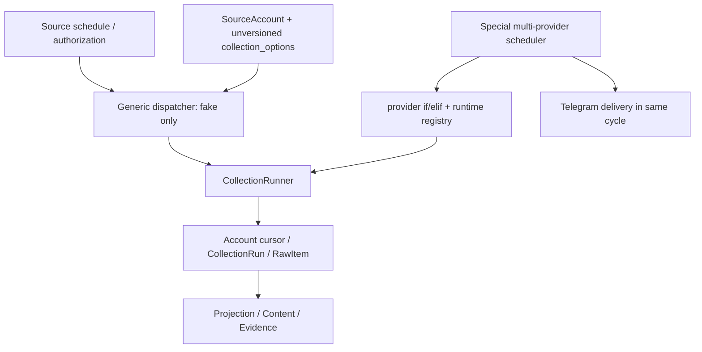
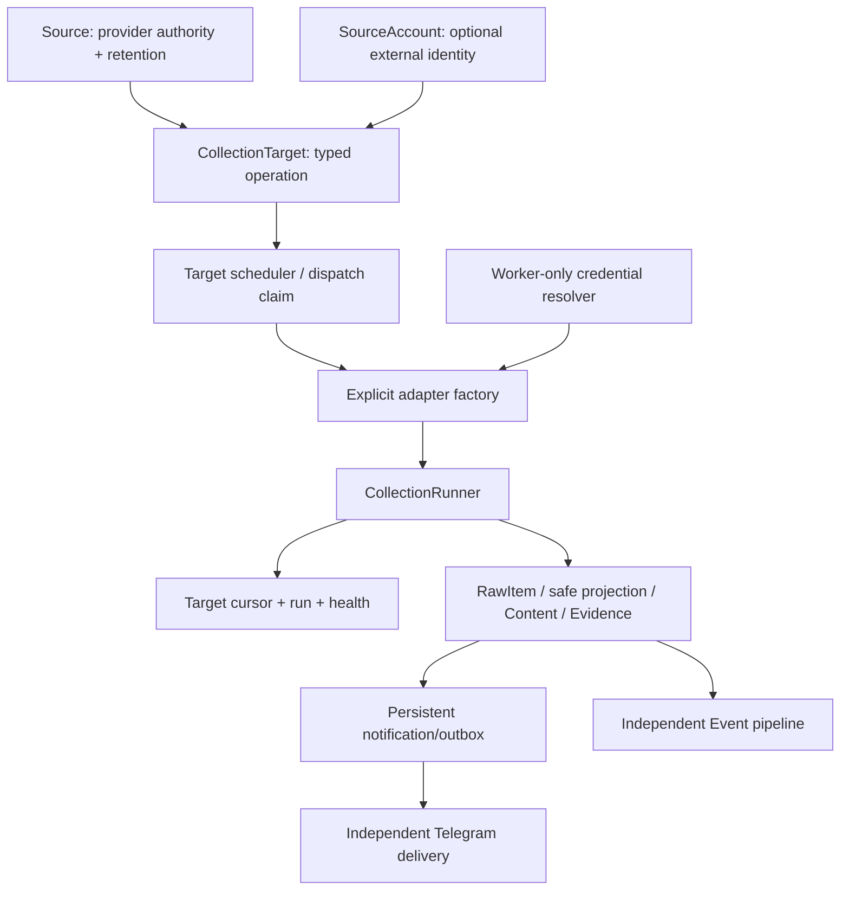

# SPEC-0041 — Unified Production Collection Control Plane

状态：Completed — Architecture Docs Review approved；Foundation v2.3 R0 PASS

阶段：Cross-phase collection reliability

负责人：Codex（设计执行）；用户/Reviewer（架构与实现授权）

创建日期：2026-08-13

最后更新：2026-08-13

## 1. 目标

设计一个 target-driven、provider-neutral、可迁移的统一生产采集控制面，使当前四个已批准
Provider 与未来官方来源共享同一调度、执行、cursor、retry、health 和恢复生命周期。本 SPEC
只交付 Docs Review；不修改 Python、migration、ORM 或运行数据，Review PASS 也不自动授权实现。

## 2. 基线与现状审计

历史设计基线为 `main@047c56410733cdcbf3b82e3b909a5cd6b05170dd`。R1 最终实施合同已按
`main@9c68dd6effe67d6f798fb080fdbffa6f80b77532` 重新审计并收敛到
`spec/SPEC-0041-implementation-unified-production-collection-control-plane.md`。PR #39
`1688e1ffb26d6c91214fee59f7da6d858924c750` 保持 Draft；其 SPEC-0040 与 migrations
`0006/0007` 不属于本分支，也不得被合并、重放或扩展。



已核实限制：

- schema 允许多个 `SourceAccount`，真实 runtime 却要求每个 provider 恰好一个 eligible target；
- generic dispatcher 过滤 `access_method="fake"`，task 也只构造 fake registry；
- real providers 由特殊 scheduler 按 provider Redis key 调度，并以 `if/elif` 注入 adapter；
- due 主要以 Source 最近 run/成功时间计算，同 Source 多账号不能独立 cadence；
- `SourceAccount.collection_options` 是任意、无版本 JSON；bootstrap 的 AAPL、technology、
  electricity 等 smoke 默认容易被误读成生产授权；
- cursor 归属 account，run 没有稳定 target identity；一个全局 `limit` 被解释成不同 operation 的
  文章、quote、series 或 filing 数量；
- collection 与 Telegram 在特殊 cycle 中编排，尚非统一 production control plane。

现有四 Provider 的 adapter、bounded runtime、最小 pipeline 与 scheduler evidence 均保留为已实现
事实；本审计只说明它们尚未形成多 target 通用控制面，不撤销既有 PASS。

## 3. Foundation 与治理边界（R0 closeout 后）

- Active Foundation：v2.3-FROZEN；R0 Freeze Review 已 PASS/Completed。该 PASS 只允许 R1 进入独立
  SPEC/Docs Review，不授权 CollectionTarget/schema、migration、runtime 或外部请求。
- R1 Docs Review 的唯一实施合同为
  `spec/SPEC-0041-implementation-unified-production-collection-control-plane.md`；implementation not authorized。
- Provider-neutral、failure-visible、credential isolation、Broad Scan 与 Controlled Push 决策继续生效。
- SPEC-0041 是唯一 Docs Review；不与 PR #39 的未合并 SPEC-0040 并行实施。
- NewsAPI.ai / Event Registry 保持 future/blocked；GDELT 保持 runtime blocked/future evaluation。
- SPEC-0005 X 范围不变；不得由控制面迁移自动创建或授权新来源。

## 4. 目标架构



核心原则：调度单元、锁单元、cursor 单元、retry 单元和 health 单元都是
`CollectionTarget`；Provider 只是 factory key 和 rate-limit group 的一个维度。

## 5. 职责与 target 数据模型

### 5.1 既有实体职责

| 载体 | 长期职责 | 不再承担 |
|---|---|---|
| `Source` | 逻辑 provider/source、`access_method`、授权、许可/retention 默认、全局 enabled | target cadence、具体 query/symbol/series、target health |
| `SourceAccount` | 可选账号/feed/组织身份与 identity verification；一个账号可有多个 target | 任意 `collection_options` 作为生产合同；cursor/schedule 的唯一载体 |
| `CollectionTarget`（新表） | 一个可独立运行且稳定寻址的 provider operation | secret、任意 endpoint、provider response |
| typed config | provider+operation 的版本化参数；严格 allowlist 与 schema validation | credential、cadence/cursor/health 等通用控制字段 |

### 5.2 Final `collection_targets` authority

本高层 SPEC 不维护第二份字段表。唯一 normative schema 是
`spec/SPEC-0041-implementation-unified-production-collection-control-plane.md` §4；字段、类型、nullable、
enum、index、constraint、trigger 和 lifecycle 必须逐项以该表为准。

已固定选择：Provider 来自 `Source.access_method`，不落 `provider_key`；operation 只用 `operation_key`，
不落 `target_type`；唯一 lifecycle gate 是 `status`，不落冗余 `enabled`。版本/配置/预算字段分别为
`operation_config_version`、positive-smallint `provider_contract_version`、`operation_config`、`batch_limit`、
`request_timeout_seconds`、`max_requests_per_run`、`max_pages_per_run`、`max_response_bytes`、
`max_runtime_seconds`。`rate_limit_group` 是 non-null static opaque group；`next_due_at`、`next_retry_at` 和
target health 字段落在 target。Retention authority 仍属于 Source，不增加 `retention_policy_ref`。

`legacy_cursor_type varchar(100) NULL` 由 Migration A 引入并在 migration Phase 2 target INSERT 时由 static operation registry 决定。它是旧
runtime rollback ownership identity，不是 cursor strategy/version；Migration B 后保留为 immutable audit。
`target_key/source_id/source_account_id/operation_key` 永久不可变，initialized `legacy_cursor_type` 同样由
永久 PostgreSQL trigger 保护，且 INSERT 后没有 NULL→value 更新例外。被任何 target 引用后，
`Source.access_method` 也永久不可变；Provider 变化必须新建 Source/target。完整 INSERT-time mapping 与临时 rollback constraint/index 生命周期见 normative
contract §4/§11。

### 5.3 target-specific state

R1 migration 按 normative contract 把 target identity 加入或迁移到：

- `collection_cursors.target_id`：`UNIQUE(target_id, cursor_type, cursor_version, run_mode)`；
- `collection_runs.target_id`：每次 run 可追溯目标；
- RawItem 不增加 `target_id`；通过 immutable
  `RawItem.collection_run_id → CollectionRun.target_id → CollectionTarget` 可逆追溯；
- health 字段直接位于 CollectionTarget，不新增 competing health table。Source 汇总状态仅供展示。

Target 删除默认禁止；retire 代替删除。Source/Account 关闭会使所有子 target fail closed。

## 6. Typed config 和 request budget

首批 operation schema 只覆盖当前已实现范围：

| Provider / operation | typed v1 config（其他字段禁止） | hard batch ceiling |
|---|---|---|---|
| `marketaux/news_all` | required query；optional language、symbols，按 normative bounds | 3 items |
| `finnhub/quote` | exactly one symbol | 1 quote |
| `eia/electricity_retail_sales` | only `dataset='electricity'`; monthly frequency/price field registry-fixed | 5 rows |
| `sec_edgar/submissions_recent` | exactly ticker + CIK | 10 filings |

Effective request budget is the minimum of: operation hard safety ceiling、verified plan/quota bound、
target override、worker global emergency ceiling。每 run 还限制 max requests/pages、wall-clock deadline 和
response bytes。quota exhaustion 进入 rate-limit group cooldown；不得用一个全局 `limit` 给不同 operation
相同语义。首批四 operation 的 `pagination_capability=none` 且 requests/pages=1；`has_more=true` 必须持久化
PARTIAL/coverage_incomplete，不重复第一页、不标 complete。真实 pagination 属于 R3–R5。

## 7. Registry / factory 与 credential boundary

统一 `ProviderAdapterFactory` 以 `(Source.access_method, operation_key, provider_contract_version)` 为显式
allowlist key。注册表由启动代码静态组装，不允许 dynamic import、数据库 class path 或任意 endpoint。

```text
validated target descriptor
→ factory lookup (unknown => fail closed)
→ worker CredentialResolver resolves named secret reference
→ operation-specific credential object (memory only)
→ allowlisted transport + adapter
→ CollectionRunner
```

- DB、typed config、Celery payload、Redis marker、repr、日志和错误不得包含 secret；
- task payload 只携带 `target_id`、exact `config_revision`、scheduled slot、run mode 和 dispatch identity；worker 必须重新从 DB 加载并
  复核 target/source/account authorization，禁止信任序列化 config；
- credential 只在 worker runtime 按 provider/credential reference 解析，不可由 CLI task argument 注入；
- factory 必须验证 adapter.provider 与 target provider、operation、contract version 匹配；
- transport host/method/endpoint family 逐 operation allowlist；禁止 fallback 到网页或其他 provider；
- credential missing 不泄露名称或值，也不阻止其他 target；R1 最终 implementation contract 固定为
  target 保持 active/degraded、不创建 run、不 fast-retry，并在下一 normal cadence 自动复核 credential。

现有 `AdapterRegistry` 与 `ProviderAdapterRegistry` 在实现期合并到上述一个 production factory；fake
作为明确 `fake/test` operation 保留，不能成为真实 provider fallback。

## 8. Scheduler / worker 生命周期

1. Scheduler 分页查询 active target，而非按 Source 限 1000 条。
2. 校验 Source/Account authorization、target config/version 与 `next_retry_at`/`next_due_at`。
3. 以 target+scheduled slot 原子 claim dispatch marker；并发 Beat/restart 只能 enqueue 一次。
4. task payload 只发送 `target_id`、exact `config_revision`、scheduled slot、run mode、dispatch id。
5. Worker 重新加载 target，获取 target owner-token lock，并创建 target-bound `CollectionRun`。
6. Factory 注入 adapter/credential/transport；runner 执行受 budget 限制的 operation。首批四个 v1
   operation 均不具备 pagination capability，最多一次请求；通用分页接口不等于当前 operation 可分页。
7. 每 batch 原子持久化 RawItem/sidecar downstream input；成功后才 checkpoint。
8. 完成、continuation、no-new-items 或分类失败分别更新 target health/next eligible time。
9. 安全释放 lock；stale recovery 按 target/run 恢复，不推进 cursor。
10. Content/Evidence 后续生成 notification/outbox；独立 delivery worker 消费，绝不反向决定 collection。

每个 target 独立 cadence、cursor、lock、retry、run、health 和 dispatch idempotency。一个 target
missing/blocked/failed 不跳过同 provider 其他 target，也不污染 Source 的调度资格。

## 9. Cursor、pagination、backfill 与 revision 合同

Cursor envelope 必须版本化并至少记录 strategy、position、tie-breaker、continuation、watermark、
run_mode 和 contract version；codec 由 operation 显式注册。

| strategy | 合法推进 | no-new-items / failure |
|---|---|---|
| strict incremental | candidate 严格大于 current | 相等是否 duplicate/no-new 由 operation 明确；更小 fail visible |
| snapshot watermark | newer 才推进 | 相等是正常 no-new；older fail visible |
| page/offset | 当前 page 完整持久化后保存 next page | page cursor 不等于时间 watermark |
| date window | 窗口完成后推进 boundary | overlap + stable identity 去重；不可跳过未完成窗口 |
| compound | `(timestamp, stable tie-breaker)` lexicographic | 同 timestamp 多 item 逐一覆盖，缺 tie-breaker fail closed |
| revision/reconciliation | official identity + revision marker | stale revision 不覆盖 newer authority |

- normal polling cursor 与 backfill cursor 必须用 `run_mode`/独立记录隔离；backfill 仅 manual/bounded；
- target 是 cursor owner，不能共享 provider/account cursor；
- batch persistence 与 checkpoint 同一事务边界或经证明等价；失败不推进；
- generic future pageable operation 才可在 cap 保存 continuation；首批 v1 不具备 continuation，
  `has_more=true` 记录 PARTIAL/coverage_incomplete，complete watermark 不推进；
- restart 从 committed checkpoint 恢复；在途无 checkpoint batch 可安全重放且由 RawItem idempotency 吸收；
- cursor codec/version 升级必须有显式 migration/compat reader，不得静默 reinterpret JSON。

## 10. Failure、retry、health 与 recovery

| 类别 | 行为 |
|---|---|
| unknown provider/operation/config version | target BLOCKED；不 retry storm；其他 target 继续 |
| credential missing | target active/degraded；no run、no fast retry；`next_retry_at=NULL`，next normal cadence recheck |
| authorization/config invalid | 按 normative state matrix blocked/fail closed；其他 target 继续 |
| timeout/429/5xx | target RETRY；尊重 Retry-After 与安全上限；target-specific full jitter |
| quota exhausted | rate-limit group cooldown；其他不共享 quota 的 target 可运行 |
| persistence/checkpoint failure | run failed/retryable；cursor 不推进 |
| cursor backward/invalid continuation | contract failure visible；不覆盖 current |
| stale run/lock loss | owner-token recovery 标 failed；不推进 cursor；重新 dispatch 受幂等保护 |
| Telegram credential/delivery failure | notification 保持 pending/retryable；collection cadence 不变 |

Retry 是 target state，不能复用 provider cadence key。non-retryable failure 按 target normal cadence 或
人工 unblock；retryable failure 使用 `next_retry_at` 早于 normal cadence。Source health 只做聚合展示，
不得让一个 target success 掩盖另一个失败。

## 11. Migration proposal（implementation 才执行）

### 11.1 Dependency/branch rule

- Foundation v2.3 Freeze Review PASS 是任何 implementation/migration 的前置条件。
- PR #39/SPEC-0040 在完整 Pre-AI Collection Readiness Program 完成前保持 Draft、不得合并。
- 实现必须从届时最新 `main` 新分支开始，不从本 Docs PR 或 PR #39 分支直接堆叠。
- PR #39 只能在 readiness 完成后基于届时最新 main 重新审计/rebase；不预先保证其现有 AI contract、
  Fact digest、snapshot 或 routing 设计全部保留。
- PR #39 当前 proposed `0006/0007` 不构成已发布 migration authority。最终 revision/down_revision 必须
  按串行合并顺序重算并验证；禁止双 head、复制 revision、invented bridge 或 rewrite 已发布历史。
- 合并顺序必须串行；任何双 head 在 merge 前解决并跑 upgrade/downgrade/re-upgrade。

### 11.2 Phased data migration

1. Phase 0–3 全部为 `none — maintenance hold`；Migration A、backfill/audit、compatible runtime 部署/验证期间
   所有 legacy collection/stale-recovery writer 持续停止。
2. 只把可确定识别的 legacy rows 转为 `status=draft` 或 `paused` target。来源通过 deterministic
   `legacy.*` target_key、既有 `created_at` 和 value-free migration AuditLog 审计；不新增 `origin` 或独立
   migration timestamp 字段。版本字段准确使用 `operation_config_version`，其他字段只引用 normative contract。
3. AAPL、technology、electricity、SEC ticker/CIK 只作为历史 bootstrap 值迁移，**不自动 active，
   不代表生产授权**；Reviewer 必须逐 target 确认 operation、quota、cadence、retention。
4. Migration Phase 2 在创建 legacy target 的 INSERT 中写入 registry-derived legacy identity；rollback window 内同一
   `(source_account_id,legacy_cursor_type)` 由一个 target 独占，任何状态都不释放。冲突 target 保持 NULL 和
   draft/paused/blocked；不复制、猜测或抢占。
5. Phase 3 完成 zero RUNNING、zero unmapped/null target identity、backfill count reconciliation 后，Phase 3A
   才恢复 legacy compatible runtime 临时 authority；Phase 4–5 shadow/approval 仍由该 runtime authoritative。
6. Phase 6 再次进入 none/cutover maintenance；Phase 7 起 unified authority。Migration B 仅在 rollback
   正式关闭、dual-write 停止、forward-recovery-only 后执行。
7. Migration B 只删除临时 active non-null constraint 和 rollback ownership index，保留永久 identity
   immutability trigger 与 legacy_cursor_type audit。删除其他 legacy 列需后续 SPEC。

Rollback：切回旧 scheduler 前停止新 worker；不删除 target/run/cursor audit。schema downgrade 仅在没有
new-only state 或完成可验证导出时允许，否则 BLOCKED。不得 down -v、清库或伪造 alembic stamp。

## 12. 文档一致性与能力分级

所有状态使用以下术语，禁止混用：

1. `preflight/smoke PASS`：endpoint/shape/security 的有界证据；
2. `minimal adapter/runtime PASS`：当前批准 operation 的代码与 bounded live evidence；
3. `production control-plane capable`：多 target、typed config、target state、unified factory、独立 delivery、
   migration/recovery 全部验收后才可声明。

当前 Marketaux/Finnhub/EIA/SEC 达到第 2 级及已审核 scheduler runtime；尚未达到第 3 级。Phase 1 core
technical path PASS 仍成立，但完整 operations/backup/restore、X 与统一生产控制面是后置能力。

Foundation v2.3-FROZEN 当前生效；R0 Completed/PASS，R1 仅 Active — Docs Review，implementation 未授权。
本 PR 只维护控制面 architecture + normative implementation contract，不执行 migration/runtime。

## 13. Future implementation exact file scope

唯一 exact file scope 见 normative implementation contract §12，包括两个串行 Migration A/B、target
repository/config/factory/control-plane、credential resolver、Notification intent/delivery task 以及完整 tests。
本高层 SPEC 不维护可能漂移的第二份文件清单。明确不修改 Event/Fact/AI、Telegram message 内容、Provider
operation 范围或 Safe Projection schema。

## 14. Future implementation test matrix

唯一 test matrix 见 normative implementation contract §14，包含 identity trigger 初始化时序、rollback
ownership、Migration A/B 三对象生命周期、PostgreSQL/Redis/Celery/concurrency/restart/regression。所有
Provider/network tests mock-only；任何 live verification 需未来独立、逐项、用户明确授权。

## 15. 验收标准（Docs Review）

- [ ] 当前与目标架构、职责和能力分级无矛盾。
- [ ] target schema、typed config、state ownership 与 secret constraints 可实施。
- [ ] multi-target lifecycle、factory、budget、cursor/backfill、retry/recovery 均 fail closed。
- [ ] notification/Event 与 collection 解耦且不重写既有 Phase 1/Event pipeline。
- [ ] legacy/default/cursor migration 不扩大授权、不丢失审计。
- [ ] PR #39 merge ordering 与 Alembic 双 head 处理明确。
- [x] Foundation v2.3-FROZEN 已通过 R0；R1 implementation 仍需独立授权。
- [ ] Pre-AI Collection Readiness R0–R9 的限制、目标、边界、依赖、影响、验证与验收均可审核。
- [ ] 测试矩阵、实现文件范围、风险与 rollback 可审核。
- [ ] NewsAPI.ai/GDELT/X/new Provider 未激活。
- [ ] 仅文档变更；无代码、migration、外部请求或 credential 读取。

## 16. 风险与 rollback

- **Identity drift**：可变 query 不得决定 target identity；config 变更需 revision/audit。
- **Cursor misbinding**：ambiguous legacy cursor 必须 blocked，不能猜。
- **Double collection**：切换期只能一个 scheduler authoritative；shadow mode 不发请求。
- **Quota burst**：rate-limit group 与 hard ceiling 在 dispatch/worker 两层校验。
- **Task staleness**：worker 按 target id 重载最新状态/version，paused/changed target fail closed。
- **PR #39 divergence**：串行 merge/rebase，禁止双 head 和 migration history rewrite。
- **Rollback data loss**：保留 additive target/state 记录；先切 worker，再回退代码；不可删除 volume。

## 17. Pre-AI Collection Readiness dependencies

完整 program contract 见 `docs/PRE_AI_COLLECTION_READINESS.md`。以下是总依赖，不表示自动授权：

| Step | 后续主题 | 依赖/门禁 |
|---|---|---|
| R0 | Foundation v2.3 Freeze Review | Completed/PASS |
| R1 | Unified Production Collection Control Plane | R0；最新 main/migration inventory |
| R2 | Durable Safe Projection | R1 target/provenance contract |
| R3 | Marketaux query/topic/entity/page/window | R1/R2；plan/license/operation review |
| R4 | EIA dataset/route/frequency/facet catalog | R1/R2；series catalog review |
| R5 | SEC multi-company/history/companyfacts/XBRL | R1/R2；CIK/taxonomy/official contract review |
| R6 | Finnhub multi-symbol typed observations | R1/R2；symbol/plan review；Market Validation excluded |
| R7 | Company IR/official RSS/macro/regulatory | R1/R2；逐 endpoint identity/license review |
| R8 | Event/Evidence/Fact completeness | R2 plus accepted R3–R7 inputs |
| R9 | deterministic+model AI routing re-audit | all R0–R8 PASS；PR #39 re-audit/rebase on latest main |

不得把 R3–R7 合并成模糊 provider expansion；每个 operation 仍有独立 mock/integration/live gate。实现
不得在 R1 implementation 明确授权前开始，也不得由本编号自动启动后续 SPEC 或覆盖 PR #39。

## 18. Verification Evidence

| 项目 | 证据 | 结果 |
|---|---|---|
| Baseline | `main@047c564...`；PR #39 Draft inspected read-only | PASS |
| Repository audit | models, generic tasks/scheduler, provider runtime/scheduler inspected | PASS |
| Static/Foundation | diff check, Foundation validator, Ruff, format, mypy | PASS |
| Regression | 444 tests | 443 PASS；1 environment-state FAIL：本机 public schema 已含 PR #39 的未合并 `event_fact_snapshots`/`impact_analyses`，current-main allowlist 拒绝；未改 DB 掩盖 |
| Package review | required files/links/freeze markers | PASS；检测到本地 `.env`，未读取、未修改、未纳入 Git/ZIP |
| External runtime | Provider/AI/Telegram requests | NOT RUN（禁止） |
| Implementation | Python/migration/schema | NOT STARTED |

## 19. Docs Review findings → resolution mapping

| Finding | 文档修正 | Gate / result |
|---|---|---|
| historical v2.2 scheduler rewrite conflict | Foundation v2.3 Freeze Review completed; normative R1 contract retains independent authorization gate | R0 PASS；R1 implementation still unauthorized |
| readiness 路线过于模糊 | 新增 `PRE_AI_COLLECTION_READINESS.md` R0–R9，SPEC §17 改为完整依赖 | R0–R8 PASS 前禁止 AI re-review |
| PR #39 未被充分冻结 | Foundation v2.3、Program R9、SPEC §11 固定 Draft/re-audit/rebase/migration rule | 不合并、不保证现设计保留 |
| Provider 状态矛盾 | 重写 Official Contracts 状态及四 Provider current/not-implemented/Pending sections | smoke/runtime/production capability 分级 |
| 正确 control-plane 设计需保留 | SPEC §5–§16 保留 target ownership、typed config、factory、budget、cursor、migration、isolation 和 tests | 仅 Docs Review，不实施 |

## 20. Review History

| 轮次 | 结果 | 主要问题 | 处理 |
|---|---|---|---|
| Docs Review 0 | REQUEST CHANGES | Foundation conflict、readiness 路线、PR #39 freeze、Provider 状态 | 新增 v2.3 Draft、R0–R9 program 并统一状态 |
| Docs Review 1 | PASS（2026-08-13） | 文档范围与治理门禁通过 | 仅批准 architecture Docs Review |
| R0 Freeze Review | PASS（2026-08-13） | 八项有限 Foundation authorization | v2.3-FROZEN；不自动启动 R1 |
| R1 Docs Review | PENDING | 最终 implementation contract | Active docs-only；implementation not authorized |
